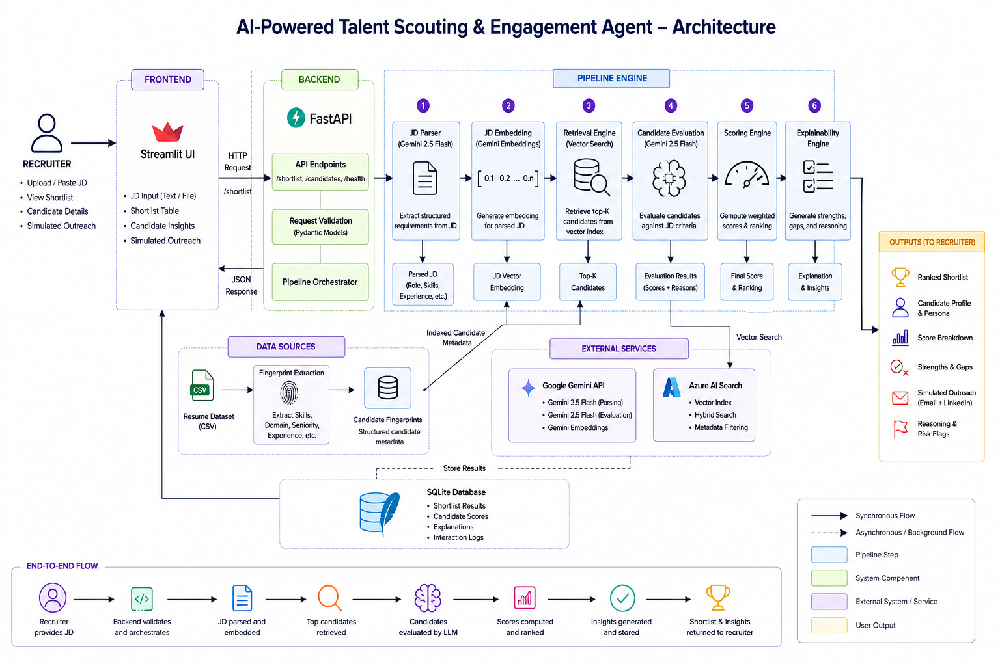

# AI-Powered Talent Scouting & Engagement Agent

An AI recruiter evaluation engine that converts a Job Description into an explainable ranked shortlist by combining semantic retrieval, candidate evaluation, Interest likelihood prediction, and recruiter-ready recommendations.

## Challenge Alignment

This project is designed as a recruiter decision-support agent rather than a chatbot.

It focuses on:

- explainable candidate ranking
- recruiter-ready outputs
- realistic hiring workflows
- semantic talent retrieval
- engagement prediction

## What this project is

- AI recruiter decision-support system
- talent scouting and engagement agent
- semantic candidate retrieval and evaluation pipeline
- explainable recruiter ranking engine
- engagement likelihood prediction workflow

## What this project is not

- chatbot
- resume search engine
- keyword-only matching demo
- generic RAG playground

## End-to-End Agent Workflow

1. Recruiter uploads or pastes Job Description
2. Gemini parses JD into structured schema
3. JD embedding generated using Gemini Embeddings
4. Azure AI Search retrieves semantically relevant candidates
5. Top retrieved candidates are evaluated using Gemini
6. Match Score and Interest Likelihood Score are calculated
7. Recommendation label assigned
8. Explainability generated:
   - persona summary
   - reasoning
   - risk flags
   - simulated recruiter outreach
   - likely candidate response
9. Final shortlist ranked and stored
10. Results shown in Streamlit dashboard

### System Architecture

The diagram below represents the full recruiter-to-shortlist execution flow used by the system.


## Technology Stack

- Frontend: Streamlit
- Backend: FastAPI
- LLM: Gemini 2.5 Flash
- Embeddings: Gemini Embeddings
- Retrieval: Azure AI Search
- Database: SQLite
- Validation: Pydantic
- Logging: Python logging

## Retrieval Layer

Azure AI Search stores candidate embeddings and metadata to enable semantic retrieval.

The system does not brute-force evaluate the full dataset.

Instead:

- embeddings are pre-indexed
- recruiter JD embedding is generated dynamically
- top semantic matches are retrieved
- only shortlisted candidates are evaluated by Gemini

## Core Features

This implementation provides:

- FastAPI API for pipeline execution
- Streamlit recruiter dashboard
- JD upload from pasted text or local file
- structured JD parsing schema
- candidate retrieval and ranking pipeline
- resume metadata extraction from the candidate universe
- explainable scoring with risk flags and recommendations
- SQLite persistence for results
- Gemini and Azure AI Search integration paths wired in
- strict provider-backed execution once `.env` is configured

## Repo structure

```text
app/
  api/         # FastAPI routes
  core/        # config, logging, exceptions
  models/      # schemas + data models
  services/    # Gemini, Azure Search, pipeline
  storage/     # SQLite persistence
frontend/      # Streamlit UI
scripts/       # runnable scripts
data/          # Resume dataset
tests/         # Test suite
assets/        # architecture + documentation images
```

## Dataset Used

This project uses a real-world resume dataset sourced from Kaggle to simulate a realistic candidate universe for retrieval and evaluation.

Dataset Source:
- Resume Dataset by Snehaan Bhawal
- Source: https://www.kaggle.com/datasets/snehaanbhawal/resume-dataset
- License: CC0 Public Domain

The original dataset contains 2400+ resumes across multiple domains including:

- Information Technology
- HR
- Engineering
- Finance
- Healthcare
- Agriculture
- Teaching
- Banking
- Sales
- Consulting
- Aviation
- Construction
- Business Development
- Public Relations
- Digital Media
- and more

For this project, the dataset was cleaned and normalized using Google Colab before indexing into Azure AI Search.

Preprocessing included:

- selecting relevant resume fields
- text normalization and cleanup
- malformed record filtering
- duplicate removal
- resume length filtering
- category balancing for evaluation diversity
- schema alignment for pipeline compatibility
- structured candidate ID generation

Primary fields used by the system:

- `ID`
- `Resume_str`
- `Category`

The cleaned dataset acts as the internal candidate universe for:

- candidate fingerprint generation
- embedding creation
- semantic retrieval
- shortlist evaluation
- recruiter workflow testing

Google Colab preprocessing notebook:
[Dataset Cleaning Notebook](https://colab.research.google.com/drive/1ouzd4UOmaKpnzQdPRdeR9ZS6fLvDvYae?usp=sharing)

You may also experiment with different datasets or randomly sampled resume subsets for testing, provided the schema remains compatible with the pipeline structure.

## Quick start

1. Create `.env` from `.env.example`.
2. Add your dataset at `data/Resume.csv`, or point `RESUME_DATA_PATH` to your CSV in `.env`.
3. Create a virtual environment.
4. Install dependencies:

```bash
pip install -r requirements.txt
```

Windows shortcut:

```powershell
.\scripts\setup.ps1
```

Expected dataset columns:

- `ID` or `candidate_id`
- `Resume_str` or `resume_text`
- `Category` or `category`
- optional: `Resume_html` or `resume_html`

Recommended `.env` values:

```bash
GEMINI_API_KEY=
GEMINI_GENERATION_MODEL=gemini-2.5-flash
GEMINI_EMBEDDING_MODEL=gemini-embedding-001
AZURE_AI_SEARCH_ENDPOINT=
AZURE_AI_SEARCH_KEY=
AZURE_AI_SEARCH_INDEX=
AZURE_AI_SEARCH_API_VERSION=2024-07-01
AZURE_AI_SEARCH_VECTOR_FIELD=resume_embedding
AZURE_AI_SEARCH_FORCE_REINDEX=false
SQLITE_DB_PATH=app.db
RESUME_DATA_PATH=data/Resume.csv
LOGS_DIR=logs
TOP_K_RETRIEVAL=15
TOP_K_EVALUATION=5
API_HOST=127.0.0.1
API_PORT=8010
STREAMLIT_HOST=127.0.0.1
STREAMLIT_PORT=8510
BACKEND_API_URL=http://127.0.0.1:8010
```

Start both services:

```powershell
.\scripts\start_all.ps1
```

Or run them individually:

```powershell
.\scripts\start_api.ps1
.\scripts\start_ui.ps1
```

## API endpoints

- `GET /health`
- `POST /api/v1/shortlist`
- `GET /api/v1/results`
- `GET /api/v1/dataset-summary`
- `GET /api/v1/search-index-status`
- `POST /api/v1/admin/sync-search-index`

## Pipeline Behavior

- recruiter pastes or uploads a JD
- system parses the JD into the locked schema
- the resume dataset acts as the internal candidate universe
- retrieval uses Azure AI Search
- evaluation uses Gemini
- weighted Match Score and Interest Likelihood Score stay locked to the blueprint formulas
- explainability returns reasons and risk flags
- shortlist is ranked and stored in SQLite
- Streamlit talks to FastAPI, matching the backend/frontend split from the blueprint
- logs are written under `logs/`

## Candidate Fingerprinting

The system creates normalized candidate metadata from resumes including:

- inferred skills
- inferred experience
- inferred seniority
- inferred role hint
- inferred domain

This fingerprint improves retrieval quality and structured evaluation consistency.

## Scoring formulas implemented

### Match score

- 35% Skills Match
- 25% Experience Match
- 15% Role Similarity
- 10% Domain Match
- 10% Resume Quality
- 5% Category Match

### Interest likelihood score

- 35% Career Alignment
- 20% Skill Continuity
- 20% Career Transition Plausibility
- 15% Seniority Fit
- 10% Domain Preference

## Candidate Evaluation Output

Each shortlisted candidate contains:

- Match Score
- Interest Likelihood Score
- Recommendation Label
- Persona Summary
- Simulated Recruiter Outreach
- Simulated Candidate Response
- Risk Flags
- Match Reasoning
- Score Breakdown

## Implementation notes

- Persona inference is grounded only in resume evidence.
- The agent does not run shortlist generation without required provider credentials in `.env`.
- Gemini handles structured JD parsing, resume embeddings, and candidate evaluation.
- Azure AI Search handles vector retrieval and can be synced from the API or Streamlit sidebar.
- Provider-facing backend calls use async network IO.
- API errors are mapped explicitly for configuration issues, provider failures, and validation/runtime issues.
- `.env` is loaded automatically by the application.
- Application logs are written to logs/app.log.
- Backend and frontend logging are centralized through Python logging configuration.

## Runtime Characteristics

Shortlist generation may take between 40–120 seconds depending on:

- retrieval count
- provider latency
- LLM evaluation load
- embedding generation

This reflects real AI evaluation workflow rather than static filtering.

Runtime depends on real provider-backed AI evaluation rather than cached or mocked responses.

## Engineering Highlights

- Async provider network IO
- Separation of frontend and backend
- Deterministic scoring formulas
- Strict JSON schema enforcement
- Explainable recruiter-facing outputs
- Provider abstraction layer
- Azure vector retrieval integration
- Resume-grounded reasoning
- Resume fingerprint enrichment for structured retrieval

## Design Philosophy

This project prioritizes recruiter decision quality over simple keyword matching.

The system intentionally combines semantic retrieval, structured evaluation, explainability, and engagement prediction to simulate a realistic recruiting workflow.

## Future Improvements

- expand automated integration and regression testing coverage
- introduce Redis caching for repeated JD evaluations and retrieval acceleration
